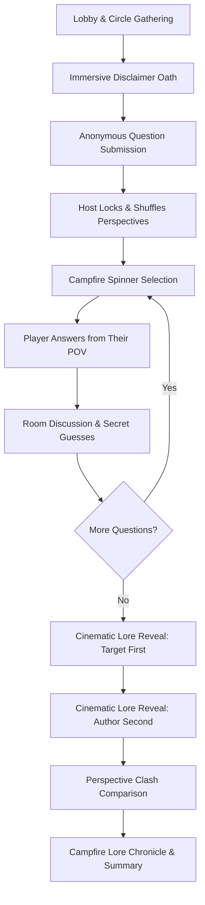

# 666-camp-fire 🔥
## A Room-Based Social Lore & Perspective Game

**666-camp-fire** is a mobile-first, real-time social perspective game built for friend groups, gangs, or squads physically gathered around a campfire or in the same room.

Rather than an online game for strangers, the game is built to reconstruct fragmented shared stories, jokes, awkward incidents, and group "lore" through anonymous questions, shuffled perspectives, open discussion, anonymous guessing, and staged cinematic reveals.

---

## 🌟 Core Philosophy & Design Principles

1. **Zero Subgroup Identification**:
   - The application **never** asks or tracks what subgroup, faction, or clique someone belongs to.
   - Everyone sitting around the campfire is simply an equal **Player**.
2. **Perspective First**:
   - When Player A writes a question intended for Player D, the campfire randomly assigns it to Player X.
   - Player X must answer based on: *"How would I interpret or respond to this question from my own perspective?"*
3. **No Forced Seriousness**:
   - Framed around memories, interpretations, and campfire banter—not a courtroom.
4. **Privacy & Respect**:
   - Players can choose **Answer Now**, **Answer Later**, or **Pass** (*"This story will remain by the fire for now"*).
5. **Strict Secret Masking**:
   - Intended targets and original authors are **physically masked at the API level** and only revealed in the designated reveal phases.

---

## 🏗️ Architecture

```
666-game/
├── server/                       # Spring Boot 3.4.x Java Backend
│   ├── src/main/java/com/campfire/
│   │   ├── entity/               # Room, Player, Question, QuestionTarget, QuestionAssignment, Guess
│   │   ├── repository/           # Spring Data JPA Repositories
│   │   ├── dto/                  # DTOs with strict privacy masking
│   │   ├── game/                 # State machine, GameService, FairAssignmentService
│   │   ├── websocket/            # STOMP / SockJS broker & GameNotifier
│   │   └── controller/           # REST endpoints & GlobalExceptionHandler
│   ├── src/main/resources/       # application.yml (H2 dev) & application-prod.yml (Postgres)
│   └── Dockerfile                # Multi-stage production container
├── client/                       # React 18 + Vite + TypeScript Frontend
│   ├── src/
│   │   ├── components/           # CampfireVisual, EmbersCanvas, LobbyCircle, Disclaimer,
│   │   │                         # QuestionComposer, CampfireSpinner, QuestionAnswering,
│   │   │                         # DiscussionAndGuessing, LoreReveal, PerspectiveComparison, Summary
│   │   ├── services/             # api.ts (REST client), websocket.ts (STOMP client)
│   │   ├── utils/                # audio.ts (Web Audio ambient sounds & chimes)
│   │   └── types/                # game.ts (TypeScript state models)
│   └── tailwind.config.js        # Warm campfire midnight palette & animations
├── render.yaml                   # Render Blueprint for zero-friction cloud deployment
└── README.md                     # Documentation
```

---

## 🎮 The 10-Phase Game Flow



1. **Lobby (`LOBBY`)**: Players gather in the circle with a Room Code or QR Code.
2. **The Oath (`DISCLAIMER`)**: All players accept the campfire principles (*"🔥 I Understand. Start the Chaos"*).
3. **Secret Whispers (`QUESTION_SUBMISSION`)**: Players write questions and specify intended recipients (hidden).
4. **Fair Perspective Shuffle (`QUESTION_SHUFFLING`)**: System runs a fair assignment algorithm so players receive questions from others to interpret.
5. **The Flame Chooses (`CHOOSING_SPEAKER`)**: The glowing campfire spinner spins with spark effects and selects the next speaker (*"🔥 THE FIRE CHOOSES: [NAME]"*).
6. **Read & Answer (`QUESTION_ANSWERING`)**: The chosen speaker unlocks the question on their phone and explains their interpretation.
7. **Discussion & Guesses (`QUESTION_DISCUSSION`)**: Open room conversation while players anonymously guess the author and target.
8. **The Lore Reveal (`TARGET_REVEAL` & `AUTHOR_REVEAL`)**:
   - **Level 1**: Intended target revealed (*"🔥 This question was actually meant for ARUN"*).
   - **Level 2**: Author revealed (*"🔥 The question was written by KARTHIK"*).
9. **Perspective Clash (`PERSPECTIVE_COMPARISON`)**: Structured side-by-side comparison of:
   - What was asked
   - What the random interpreter understood
   - What the intended target says
   - What the author actually meant
   - What the circle guessed
10. **The Fire Remembers (`SESSION_COMPLETE`)**: Closing lore chronicle and recap:
    > *"You entered with assumptions. The fire heard everyone's version."*

---

## 🚀 Running Locally

### Prerequisites
- **Node.js** v18+ and **npm**
- **Java** 21+ and **Maven**

### 1. Start the Backend
The backend defaults to an embedded **H2 database** for instant zero-dependency local development.

```bash
cd server
mvn spring-boot:run
```
The server will start at `http://localhost:8080`.
- Health check: `http://localhost:8080/api/rooms/health`
- WebSocket endpoint: `http://localhost:8080/ws-campfire`

### 2. Start the Frontend
In another terminal:

```bash
cd client
npm install
npm run dev
```
The client will start at `http://localhost:5173`.
Open `http://localhost:5173` on your browser or mobile phone on the same Wi-Fi network!

---

## 🌐 Deploying to Render

A complete `render.yaml` Blueprint is provided in the repository.

### One-Click Blueprint Deployment:
1. Push your repository to GitHub.
2. Go to [Render Dashboard](https://dashboard.render.com/) -> **New** -> **Blueprint**.
3. Connect your repository.
4. Render will automatically provision:
   - `campfire-db`: Managed PostgreSQL database.
   - `campfire-backend`: Spring Boot Docker service with automatic `DATABASE_URL` wiring.
   - `campfire-frontend`: Static site with SPA routing and automatic API proxy configuration.

### Environment Variables Reference
| Variable | Description | Default |
|---|---|---|
| `SPRING_PROFILES_ACTIVE` | Spring Boot profile (`prod` enables PostgreSQL) | `local` |
| `SPRING_DATASOURCE_URL` or `DATABASE_URL` | PostgreSQL connection URL | `jdbc:h2:mem:campfiredb` |
| `SPRING_DATASOURCE_USERNAME` | Database username | `sa` (H2) |
| `SPRING_DATASOURCE_PASSWORD` | Database password | empty (H2) |
| `CORS_ALLOWED_ORIGINS` | Comma-separated allowed frontend origins | `*` |
| `VITE_API_URL` | Frontend API base URL | `/api` |
| `VITE_WS_URL` | Frontend WebSocket endpoint | `/ws-campfire` |

---

## 🧪 Testing

Run backend automated tests:
```bash
cd server
mvn test
```
- Validates **`FairAssignmentServiceTest`**: Guarantees balanced distribution and eliminates self-assignment.
- Validates **`VisibilitySecurityTest`**: Verifies that `authorPlayerId` and `targetPlayerIds` are strictly masked in active gameplay and only returned during reveal phases.

Verify frontend build:
```bash
cd client
npm run build
```

---

## 🔒 Security & Fair Assignment Guarantee
- **Fair Assignment Algorithm**: Uses constraint satisfaction to ensure that when $N$ players submit $N$ questions, each player receives a question not authored by themselves, with balanced loads.
- **Data Isolation**: Rooms are isolated by unique random room codes and player session tokens stored in secure headers (`X-Player-Token`).
- **No Early Metadata Leaks**: The backend DTO transformation strips all sensitive relational IDs until state transitions officially reach `TARGET_REVEAL` or `AUTHOR_REVEAL`.
